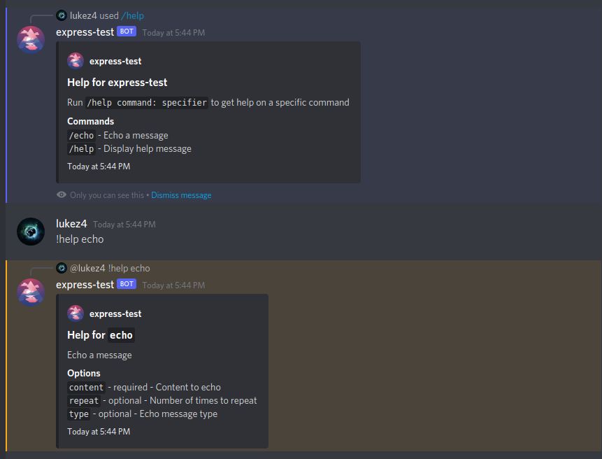
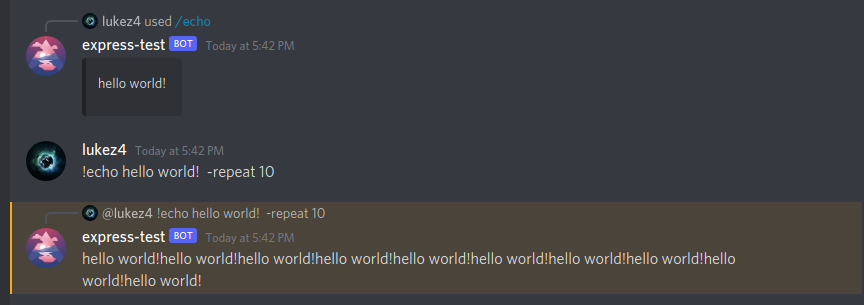

# Minimal Example

A barebones example bot made with discord-express

## Notes

-   Copy the `.env.example` file to `.env` and add your application and bot tokens
-   In `package.json`, replace `"discord-express": "link:../../dist"` with the latest version of discord-express
-   Run with `node --experimental-vm-modules --es-module-specifier-resolution=node src/index.js`

## Screenshots

